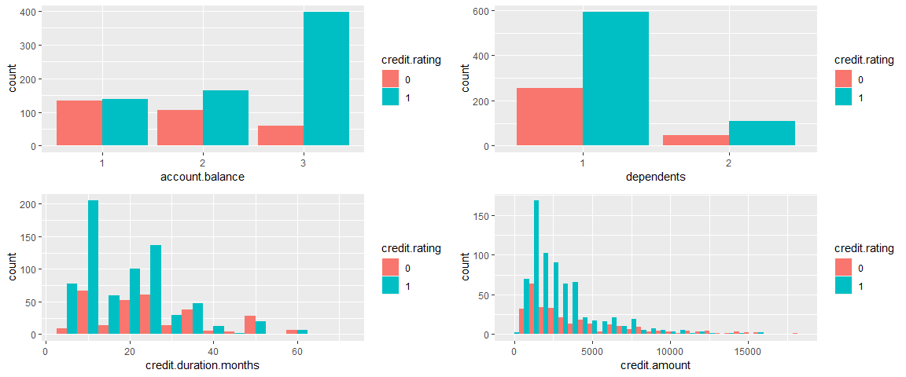
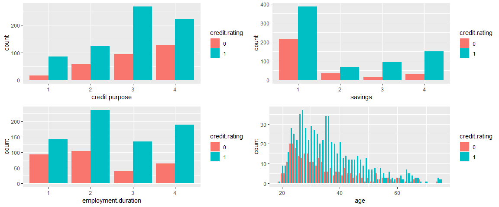
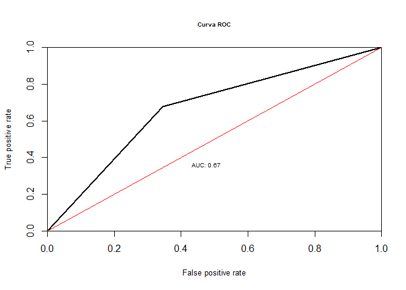
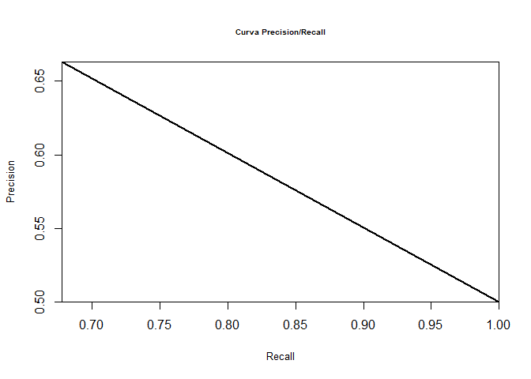
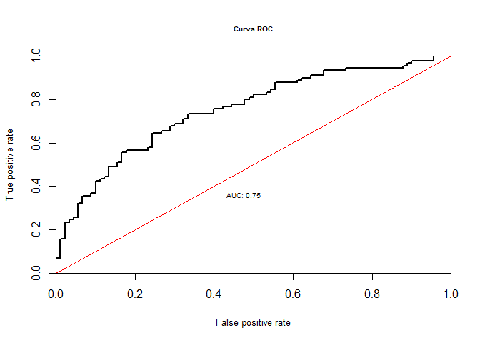
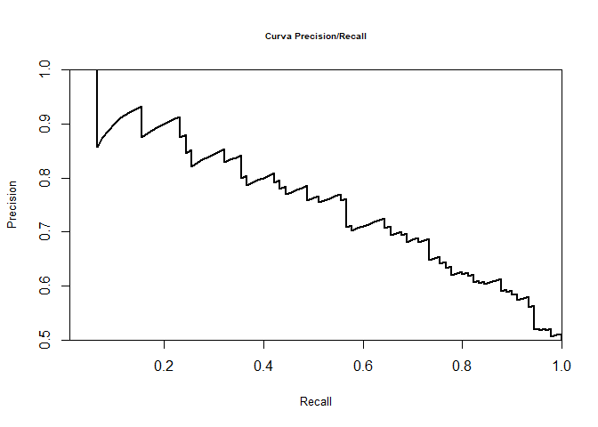

Credit Score Analysis
================

### Carregando bibliotecas

``` r
library(ggplot2)
library(gridExtra)
library(skimr)
library(dplyr)
library(dummies)
library(randomForest)
library(caTools)
library(caret)
library(ROCR)
library(corrplot)
library(parallel)
library(doParallel)
source("plot_utils.R")
```

## Carregando Dataset

``` r
df <- read.table("credit_dataset.csv", sep = ",", header = TRUE)
```

## Transformando variáveis em fatores

``` r
str(df)
```

    ## 'data.frame':    1000 obs. of  21 variables:
    ##  $ credit.rating                 : int  1 1 1 1 1 1 1 1 1 1 ...
    ##  $ account.balance               : int  1 1 2 1 1 1 1 1 3 2 ...
    ##  $ credit.duration.months        : int  18 9 12 12 12 10 8 6 18 24 ...
    ##  $ previous.credit.payment.status: int  3 3 2 3 3 3 3 3 3 2 ...
    ##  $ credit.purpose                : int  2 4 4 4 4 4 4 4 3 3 ...
    ##  $ credit.amount                 : int  1049 2799 841 2122 2171 2241 3398 1361 1098 3758 ...
    ##  $ savings                       : int  1 1 2 1 1 1 1 1 1 3 ...
    ##  $ employment.duration           : int  1 2 3 2 2 1 3 1 1 1 ...
    ##  $ installment.rate              : int  4 2 2 3 4 1 1 2 4 1 ...
    ##  $ marital.status                : int  1 3 1 3 3 3 3 3 1 1 ...
    ##  $ guarantor                     : int  1 1 1 1 1 1 1 1 1 1 ...
    ##  $ residence.duration            : int  4 2 4 2 4 3 4 4 4 4 ...
    ##  $ current.assets                : int  2 1 1 1 2 1 1 1 3 4 ...
    ##  $ age                           : int  21 36 23 39 38 48 39 40 65 23 ...
    ##  $ other.credits                 : int  2 2 2 2 1 2 2 2 2 2 ...
    ##  $ apartment.type                : int  1 1 1 1 2 1 2 2 2 1 ...
    ##  $ bank.credits                  : int  1 2 1 2 2 2 2 1 2 1 ...
    ##  $ occupation                    : int  3 3 2 2 2 2 2 2 1 1 ...
    ##  $ dependents                    : int  1 2 1 2 1 2 1 2 1 1 ...
    ##  $ telephone                     : int  1 1 1 1 1 1 1 1 1 1 ...
    ##  $ foreign.worker                : int  1 1 1 2 2 2 2 2 1 1 ...

``` r
df[,-c(3,6,14)] <- lapply(df[,-c(3,6,14)], as.factor)
summary(df)
```

    ##  credit.rating account.balance credit.duration.months
    ##  0:300         1:274           Min.   : 4.0          
    ##  1:700         2:269           1st Qu.:12.0          
    ##                3:457           Median :18.0          
    ##                                Mean   :20.9          
    ##                                3rd Qu.:24.0          
    ##                                Max.   :72.0          
    ##  previous.credit.payment.status credit.purpose credit.amount   savings
    ##  1: 89                          1:103          Min.   :  250   1:603  
    ##  2:530                          2:181          1st Qu.: 1366   2:103  
    ##  3:381                          3:364          Median : 2320   3:111  
    ##                                 4:352          Mean   : 3271   4:183  
    ##                                                3rd Qu.: 3972          
    ##                                                Max.   :18424          
    ##  employment.duration installment.rate marital.status guarantor
    ##  1:234               1:136            1:360          1:907    
    ##  2:339               2:231            3:548          2: 93    
    ##  3:174               3:157            4: 92                   
    ##  4:253               4:476                                    
    ##                                                               
    ##                                                               
    ##  residence.duration current.assets      age        other.credits
    ##  1:130              1:282          Min.   :19.00   1:186        
    ##  2:308              2:232          1st Qu.:27.00   2:814        
    ##  3:149              3:332          Median :33.00                
    ##  4:413              4:154          Mean   :35.54                
    ##                                    3rd Qu.:42.00                
    ##                                    Max.   :75.00                
    ##  apartment.type bank.credits occupation dependents telephone
    ##  1:179          1:633        1: 22      1:845      1:596    
    ##  2:714          2:367        2:200      2:155      2:404    
    ##  3:107                       3:630                          
    ##                              4:148                          
    ##                                                             
    ##                                                             
    ##  foreign.worker
    ##  1:963         
    ##  2: 37         
    ##                
    ##                
    ##                
    ## 

# EDA

``` r
grid.arrange(ggplot(df, aes(x=account.balance, fill=credit.rating))+ geom_bar(position = "dodge"),
             ggplot(df, aes(x=dependents, fill=credit.rating))+ geom_bar(position = "dodge"),
             ggplot(df, aes(x=credit.duration.months, fill=credit.rating))+ geom_histogram(position = "dodge", binwidth = 5),
             ggplot(df, aes(x=credit.amount, fill=credit.rating))+ geom_histogram(position = "dodge"), 
             ncol=2)
```

    ## `stat_bin()` using `bins = 30`. Pick better value with `binwidth`.

<!-- -->

``` r
grid.arrange(ggplot(df, aes(x=credit.purpose, fill=credit.rating))+ geom_bar(position = "dodge"),
             ggplot(df, aes(x=savings, fill=credit.rating))+ geom_bar(position = "dodge"),
             ggplot(df, aes(x=employment.duration, fill=credit.rating))+ geom_bar(position = "dodge"),
             ggplot(df, aes(x=age, fill=credit.rating))+ geom_bar(position = "dodge"), 
             ncol=2)
```

<!-- -->

``` r
skim(df)
```

    ## Skim summary statistics
    ##  n obs: 1000 
    ##  n variables: 21 
    ## 
    ## -- Variable type:factor ---------------------------------------------------------------
    ##                        variable missing complete    n n_unique
    ##                 account.balance       0     1000 1000        3
    ##                  apartment.type       0     1000 1000        3
    ##                    bank.credits       0     1000 1000        2
    ##                  credit.purpose       0     1000 1000        4
    ##                   credit.rating       0     1000 1000        2
    ##                  current.assets       0     1000 1000        4
    ##                      dependents       0     1000 1000        2
    ##             employment.duration       0     1000 1000        4
    ##                  foreign.worker       0     1000 1000        2
    ##                       guarantor       0     1000 1000        2
    ##                installment.rate       0     1000 1000        4
    ##                  marital.status       0     1000 1000        3
    ##                      occupation       0     1000 1000        4
    ##                   other.credits       0     1000 1000        2
    ##  previous.credit.payment.status       0     1000 1000        3
    ##              residence.duration       0     1000 1000        4
    ##                         savings       0     1000 1000        4
    ##                       telephone       0     1000 1000        2
    ##                      top_counts ordered
    ##   3: 457, 1: 274, 2: 269, NA: 0   FALSE
    ##   2: 714, 1: 179, 3: 107, NA: 0   FALSE
    ##           1: 633, 2: 367, NA: 0   FALSE
    ##  3: 364, 4: 352, 2: 181, 1: 103   FALSE
    ##           1: 700, 0: 300, NA: 0   FALSE
    ##  3: 332, 1: 282, 2: 232, 4: 154   FALSE
    ##           1: 845, 2: 155, NA: 0   FALSE
    ##  2: 339, 4: 253, 1: 234, 3: 174   FALSE
    ##            1: 963, 2: 37, NA: 0   FALSE
    ##            1: 907, 2: 93, NA: 0   FALSE
    ##  4: 476, 2: 231, 3: 157, 1: 136   FALSE
    ##    3: 548, 1: 360, 4: 92, NA: 0   FALSE
    ##   3: 630, 2: 200, 4: 148, 1: 22   FALSE
    ##           2: 814, 1: 186, NA: 0   FALSE
    ##    2: 530, 3: 381, 1: 89, NA: 0   FALSE
    ##  4: 413, 2: 308, 3: 149, 1: 130   FALSE
    ##  1: 603, 4: 183, 3: 111, 2: 103   FALSE
    ##           1: 596, 2: 404, NA: 0   FALSE
    ## 
    ## -- Variable type:integer --------------------------------------------------------------
    ##                variable missing complete    n    mean      sd  p0    p25
    ##                     age       0     1000 1000   35.54   11.35  19   27  
    ##           credit.amount       0     1000 1000 3271.25 2822.75 250 1365.5
    ##  credit.duration.months       0     1000 1000   20.9    12.06   4   12  
    ##     p50     p75  p100     hist
    ##    33     42       75 <U+2587><U+2587><U+2586><U+2583><U+2582><U+2581><U+2581><U+2581>
    ##  2319.5 3972.25 18424 <U+2587><U+2583><U+2582><U+2581><U+2581><U+2581><U+2581><U+2581>
    ##    18     24       72 <U+2587><U+2585><U+2585><U+2583><U+2581><U+2581><U+2581><U+2581>

## Normalizando base

``` r
set.seed(123)


cluster <- makeCluster(detectCores() - 1) #Parametro para detectar o números de núcleos do processador para processamento paralelo
registerDoParallel(cluster) #Parametro para detectar o números de núcleos do processador para processamento paralelo

Base1 <- subset(df, df$credit.rating == 1)
Base0 <- subset(df, df$credit.rating == 0)

dim(Base1)
```

    ## [1] 700  21

``` r
dim(Base0)
```

    ## [1] 300  21

``` r
dt = sort(sample(nrow(Base1), 300))
Amostra_1 <- Base1[dt,] 
base_balanceada = rbind(Base0, Amostra_1)
table(base_balanceada$credit.rating)
```

    ## 
    ##   0   1 
    ## 300 300

## Correlação

``` r
nums <- unlist(lapply(df, is.numeric))
cor(df[,nums])
```

    ##                        credit.duration.months credit.amount         age
    ## credit.duration.months             1.00000000    0.62498846 -0.03754986
    ## credit.amount                      0.62498846    1.00000000  0.03227268
    ## age                               -0.03754986    0.03227268  1.00000000

## Amostra de treino e teste

``` r
amostra <- sample.split(base_balanceada$credit.rating, SplitRatio = 0.70)

treino = subset(base_balanceada, amostra == TRUE)

teste = subset(base_balanceada, amostra == FALSE)
```

## Seleção de variáveis usando random forest

``` r
control <- rfeControl(functions=rfFuncs, method="cv", number=10)

modelo_fs <- randomForest(credit.rating ~ .
                          ,data = treino,
                          na.action = na.roughfix)

importance <- varImp(modelo_fs, scale=FALSE)

print(importance)
```

    ##                                  Overall
    ## account.balance                26.542514
    ## credit.duration.months         21.116294
    ## previous.credit.payment.status  9.262262
    ## credit.purpose                 11.682127
    ## credit.amount                  24.159809
    ## savings                        12.342027
    ## employment.duration            11.173898
    ## installment.rate               10.631565
    ## marital.status                  6.938526
    ## guarantor                       2.155371
    ## residence.duration              9.572533
    ## current.assets                 10.699359
    ## age                            20.685212
    ## other.credits                   4.133314
    ## apartment.type                  6.069678
    ## bank.credits                    3.773892
    ## occupation                      8.368205
    ## dependents                      2.593289
    ## telephone                       3.913374
    ## foreign.worker                  1.529902

## Criando modelo de random forest utilizando repeated cross-validation para determinar melhores parametros do modelo

``` r
train.control <- trainControl(method = "repeatedcv", 
                              number = 10, repeats = 3, search = "random", allowParallel = TRUE)

model <- train(credit.rating ~ credit.amount
               + account.balance
               + credit.duration.months
               + age
               , data = treino, method = "rf",
               metric = "Accuracy",
               tuneLength=15,
               trControl = train.control, na.action = na.roughfix)
model
```

    ## Random Forest 
    ## 
    ## 420 samples
    ##   4 predictor
    ##   2 classes: '0', '1' 
    ## 
    ## No pre-processing
    ## Resampling: Cross-Validated (10 fold, repeated 3 times) 
    ## Summary of sample sizes: 378, 378, 378, 378, 378, 378, ... 
    ## Resampling results across tuning parameters:
    ## 
    ##   mtry  Accuracy   Kappa    
    ##   1     0.6880952  0.3761905
    ##   2     0.7087302  0.4174603
    ##   3     0.6809524  0.3619048
    ##   4     0.6682540  0.3365079
    ##   5     0.6579365  0.3158730
    ## 
    ## Accuracy was used to select the optimal model using the largest value.
    ## The final value used for the model was mtry = 2.

``` r
summary(model)
```

    ##                 Length Class      Mode     
    ## call               4   -none-     call     
    ## type               1   -none-     character
    ## predicted        420   factor     numeric  
    ## err.rate        1500   -none-     numeric  
    ## confusion          6   -none-     numeric  
    ## votes            840   matrix     numeric  
    ## oob.times        420   -none-     numeric  
    ## classes            2   -none-     character
    ## importance         5   -none-     numeric  
    ## importanceSD       0   -none-     NULL     
    ## localImportance    0   -none-     NULL     
    ## proximity          0   -none-     NULL     
    ## ntree              1   -none-     numeric  
    ## mtry               1   -none-     numeric  
    ## forest            14   -none-     list     
    ## y                420   factor     numeric  
    ## test               0   -none-     NULL     
    ## inbag              0   -none-     NULL     
    ## xNames             5   -none-     character
    ## problemType        1   -none-     character
    ## tuneValue          1   data.frame list     
    ## obsLevels          2   -none-     character
    ## param              0   -none-     list

## Fazendo predições no conjunto de teste

``` r
previsoes <- data.frame(observado = teste$credit.rating,
                        previsto = predict(model, newdata = teste))

confusionMatrix(previsoes$observado, previsoes$previsto)
```

    ## Confusion Matrix and Statistics
    ## 
    ##           Reference
    ## Prediction  0  1
    ##          0 59 31
    ##          1 29 61
    ##                                          
    ##                Accuracy : 0.6667         
    ##                  95% CI : (0.5927, 0.735)
    ##     No Information Rate : 0.5111         
    ##     P-Value [Acc > NIR] : 1.73e-05       
    ##                                          
    ##                   Kappa : 0.3333         
    ##                                          
    ##  Mcnemar's Test P-Value : 0.8973         
    ##                                          
    ##             Sensitivity : 0.6705         
    ##             Specificity : 0.6630         
    ##          Pos Pred Value : 0.6556         
    ##          Neg Pred Value : 0.6778         
    ##              Prevalence : 0.4889         
    ##          Detection Rate : 0.3278         
    ##    Detection Prevalence : 0.5000         
    ##       Balanced Accuracy : 0.6667         
    ##                                          
    ##        'Positive' Class : 0              
    ## 

## Curva ROC e Precision Recall

``` r
predictions <- prediction(as.numeric(previsoes$previsto), as.numeric(previsoes$observado))

plot.roc.curve(predictions, title.text = "Curva ROC")
```

<!-- -->

``` r
plot.pr.curve(predictions, title.text = "Curva Precision/Recall")
```

<!-- -->

## Segundo modelo, utilizando regressão logística

Como podemos observar, o nível de confiança de algumas variáveis está
muito baixo.

``` r
modelo2 <- glm(credit.rating ~
                 .,
               family=binomial(link='logit'),data=treino)

summary(modelo2)
```

    ## 
    ## Call:
    ## glm(formula = credit.rating ~ ., family = binomial(link = "logit"), 
    ##     data = treino)
    ## 
    ## Deviance Residuals: 
    ##      Min        1Q    Median        3Q       Max  
    ## -2.49610  -0.78464  -0.00209   0.83919   2.44768  
    ## 
    ## Coefficients:
    ##                                   Estimate Std. Error z value Pr(>|z|)    
    ## (Intercept)                     -9.957e-01  1.270e+00  -0.784 0.433173    
    ## account.balance2                 5.477e-01  3.114e-01   1.759 0.078618 .  
    ## account.balance3                 1.766e+00  3.259e-01   5.420 5.94e-08 ***
    ## credit.duration.months          -3.364e-02  1.448e-02  -2.324 0.020151 *  
    ## previous.credit.payment.status2  1.217e+00  5.321e-01   2.286 0.022241 *  
    ## previous.credit.payment.status3  1.240e+00  5.527e-01   2.243 0.024889 *  
    ## credit.purpose2                 -1.356e+00  5.616e-01  -2.414 0.015760 *  
    ## credit.purpose3                 -1.543e+00  5.462e-01  -2.825 0.004733 ** 
    ## credit.purpose4                 -1.729e+00  5.244e-01  -3.297 0.000977 ***
    ## credit.amount                   -1.345e-04  6.688e-05  -2.011 0.044302 *  
    ## savings2                         2.463e-01  4.438e-01   0.555 0.578871    
    ## savings3                         1.162e+00  5.076e-01   2.289 0.022064 *  
    ## savings4                         1.048e+00  3.562e-01   2.943 0.003250 ** 
    ## employment.duration2             3.685e-01  3.383e-01   1.089 0.275985    
    ## employment.duration3             5.270e-01  4.072e-01   1.294 0.195649    
    ## employment.duration4            -9.668e-02  3.898e-01  -0.248 0.804114    
    ## installment.rate2               -4.619e-02  4.495e-01  -0.103 0.918158    
    ## installment.rate3               -3.105e-01  4.876e-01  -0.637 0.524175    
    ## installment.rate4               -5.608e-01  4.518e-01  -1.241 0.214568    
    ## marital.status3                  5.010e-01  2.939e-01   1.705 0.088268 .  
    ## marital.status4                  1.323e-01  4.382e-01   0.302 0.762785    
    ## guarantor2                       2.009e-01  4.350e-01   0.462 0.644191    
    ## residence.duration2             -6.200e-01  4.450e-01  -1.393 0.163490    
    ## residence.duration3             -4.171e-01  5.254e-01  -0.794 0.427219    
    ## residence.duration4              1.423e-01  4.518e-01   0.315 0.752744    
    ## current.assets2                 -1.445e-01  3.608e-01  -0.400 0.688796    
    ## current.assets3                  1.098e-02  3.414e-01   0.032 0.974333    
    ## current.assets4                 -7.365e-01  6.878e-01  -1.071 0.284261    
    ## age                              4.262e-03  1.241e-02   0.344 0.731205    
    ## other.credits2                   5.838e-01  3.321e-01   1.758 0.078795 .  
    ## apartment.type2                  7.153e-01  3.444e-01   2.077 0.037781 *  
    ## apartment.type3                  1.045e+00  7.967e-01   1.311 0.189703    
    ## bank.credits2                   -1.715e-02  3.251e-01  -0.053 0.957937    
    ## occupation2                      3.978e-01  8.695e-01   0.458 0.647296    
    ## occupation3                      1.532e-02  8.397e-01   0.018 0.985447    
    ## occupation4                      6.770e-01  8.812e-01   0.768 0.442320    
    ## dependents2                     -4.197e-01  3.854e-01  -1.089 0.276220    
    ## telephone2                       4.714e-01  2.927e-01   1.610 0.107319    
    ## foreign.worker2                  1.659e+00  8.477e-01   1.957 0.050384 .  
    ## ---
    ## Signif. codes:  0 '***' 0.001 '**' 0.01 '*' 0.05 '.' 0.1 ' ' 1
    ## 
    ## (Dispersion parameter for binomial family taken to be 1)
    ## 
    ##     Null deviance: 582.24  on 419  degrees of freedom
    ## Residual deviance: 424.16  on 381  degrees of freedom
    ## AIC: 502.16
    ## 
    ## Number of Fisher Scoring iterations: 5

## Gerando uma base com variáveis Dummys

``` r
base_balanceada2 <- dummy.data.frame(base_balanceada, names = c("account.balance", "previous.credit.payment.status",
                                                                "credit.purpose", "savings", "employment.duration",
                                                                "installment.rate", "marital.status", "guarantor",
                                                                "residence.duration", "current.assets", "other.credits",
                                                                "apartment.type", "bank.credits", "occupation", "dependents",
                                                                "telephone", "foreign.worker"
))

str(base_balanceada2)
```

    ## 'data.frame':    600 obs. of  56 variables:
    ##  $ credit.rating                  : Factor w/ 2 levels "0","1": 1 1 1 1 1 1 1 1 1 1 ...
    ##  $ account.balance1               : int  0 1 0 0 1 0 1 0 0 1 ...
    ##  $ account.balance2               : int  1 0 0 1 0 1 0 1 0 0 ...
    ##  $ account.balance3               : int  0 0 1 0 0 0 0 0 1 0 ...
    ##  $ credit.duration.months         : int  36 18 18 36 15 48 12 12 9 12 ...
    ##  $ previous.credit.payment.status1: int  0 0 0 0 0 1 0 0 0 0 ...
    ##  $ previous.credit.payment.status2: int  1 1 0 0 1 0 1 1 1 0 ...
    ##  $ previous.credit.payment.status3: int  0 0 1 1 0 0 0 0 0 1 ...
    ##  $ credit.purpose1                : int  0 0 0 0 0 0 0 0 0 0 ...
    ##  $ credit.purpose2                : int  0 0 0 0 0 0 0 0 0 0 ...
    ##  $ credit.purpose3                : int  1 0 1 0 0 0 0 0 1 0 ...
    ##  $ credit.purpose4                : int  0 1 0 1 1 1 1 1 0 1 ...
    ##  $ credit.amount                  : int  2384 1216 1864 4455 3959 6416 1228 685 745 3499 ...
    ##  $ savings1                       : int  1 1 0 1 1 1 1 1 1 1 ...
    ##  $ savings2                       : int  0 0 1 0 0 0 0 0 0 0 ...
    ##  $ savings3                       : int  0 0 0 0 0 0 0 0 0 0 ...
    ##  $ savings4                       : int  0 0 0 0 0 0 0 0 0 0 ...
    ##  $ employment.duration1           : int  1 1 0 0 0 0 0 0 0 0 ...
    ##  $ employment.duration2           : int  0 0 1 1 1 0 1 0 1 1 ...
    ##  $ employment.duration3           : int  0 0 0 0 0 0 0 1 0 0 ...
    ##  $ employment.duration4           : int  0 0 0 0 0 1 0 0 0 0 ...
    ##  $ installment.rate1              : int  0 0 0 0 0 0 0 0 0 0 ...
    ##  $ installment.rate2              : int  0 0 0 1 0 0 0 1 0 0 ...
    ##  $ installment.rate3              : int  0 0 0 0 1 0 0 0 1 1 ...
    ##  $ installment.rate4              : int  1 1 1 0 0 1 1 0 0 0 ...
    ##  $ marital.status1                : int  0 1 1 1 1 1 1 0 1 1 ...
    ##  $ marital.status3                : int  1 0 0 0 0 0 0 0 0 0 ...
    ##  $ marital.status4                : int  0 0 0 0 0 0 0 1 0 0 ...
    ##  $ guarantor1                     : int  1 1 1 1 1 1 1 1 1 0 ...
    ##  $ guarantor2                     : int  0 0 0 0 0 0 0 0 0 1 ...
    ##  $ residence.duration1            : int  1 0 0 0 0 0 0 0 0 0 ...
    ##  $ residence.duration2            : int  0 0 1 1 1 0 1 0 1 1 ...
    ##  $ residence.duration3            : int  0 1 0 0 0 1 0 1 0 0 ...
    ##  $ residence.duration4            : int  0 0 0 0 0 0 0 0 0 0 ...
    ##  $ current.assets1                : int  0 0 1 1 0 0 1 0 1 1 ...
    ##  $ current.assets2                : int  0 0 0 0 1 0 0 0 0 0 ...
    ##  $ current.assets3                : int  0 1 0 0 0 0 0 1 0 0 ...
    ##  $ current.assets4                : int  1 0 0 0 0 1 0 0 0 0 ...
    ##  $ age                            : int  33 23 30 30 29 59 24 25 28 29 ...
    ##  $ other.credits1                 : int  0 0 0 1 0 0 0 1 0 0 ...
    ##  $ other.credits2                 : int  1 1 1 0 1 1 1 0 1 1 ...
    ##  $ apartment.type1                : int  1 1 0 0 0 1 0 0 0 0 ...
    ##  $ apartment.type2                : int  0 0 1 1 1 0 1 1 1 1 ...
    ##  $ apartment.type3                : int  0 0 0 0 0 0 0 0 0 0 ...
    ##  $ bank.credits1                  : int  1 1 0 0 1 1 1 1 1 0 ...
    ##  $ bank.credits2                  : int  0 0 1 1 0 0 0 0 0 1 ...
    ##  $ occupation1                    : int  0 0 0 0 0 0 0 0 0 0 ...
    ##  $ occupation2                    : int  1 0 0 0 0 0 1 1 1 0 ...
    ##  $ occupation3                    : int  0 1 1 0 1 1 0 0 0 1 ...
    ##  $ occupation4                    : int  0 0 0 1 0 0 0 0 0 0 ...
    ##  $ dependents1                    : int  1 1 1 1 1 1 1 1 1 1 ...
    ##  $ dependents2                    : int  0 0 0 0 0 0 0 0 0 0 ...
    ##  $ telephone1                     : int  1 0 1 0 0 1 1 1 1 1 ...
    ##  $ telephone2                     : int  0 1 0 1 1 0 0 0 0 0 ...
    ##  $ foreign.worker1                : int  1 1 1 1 1 1 1 1 1 1 ...
    ##  $ foreign.worker2                : int  0 0 0 0 0 0 0 0 0 0 ...
    ##  - attr(*, "dummies")=List of 17
    ##   ..$ account.balance               : int  2 3 4
    ##   ..$ previous.credit.payment.status: int  6 7 8
    ##   ..$ credit.purpose                : int  9 10 11 12
    ##   ..$ savings                       : int  14 15 16 17
    ##   ..$ employment.duration           : int  18 19 20 21
    ##   ..$ installment.rate              : int  22 23 24 25
    ##   ..$ marital.status                : int  26 27 28
    ##   ..$ guarantor                     : int  29 30
    ##   ..$ residence.duration            : int  31 32 33 34
    ##   ..$ current.assets                : int  35 36 37 38
    ##   ..$ other.credits                 : int  40 41
    ##   ..$ apartment.type                : int  42 43 44
    ##   ..$ bank.credits                  : int  45 46
    ##   ..$ occupation                    : int  47 48 49 50
    ##   ..$ dependents                    : int  51 52
    ##   ..$ telephone                     : int  53 54
    ##   ..$ foreign.worker                : int  55 56

``` r
treino2 = subset(base_balanceada2, amostra == TRUE)

teste2 = subset(base_balanceada2, amostra == FALSE)
```

## Aplicando método stepwise para seleção de variáveis

``` r
step(glm(credit.rating ~
           .,
         family=binomial(link='logit'),data=treino2), direction = "both", trace = FALSE)
```

    ## 
    ## Call:  glm(formula = credit.rating ~ account.balance1 + account.balance2 + 
    ##     credit.duration.months + previous.credit.payment.status1 + 
    ##     credit.purpose1 + credit.amount + savings1 + savings2 + residence.duration2 + 
    ##     other.credits1 + apartment.type1 + telephone1 + foreign.worker1, 
    ##     family = binomial(link = "logit"), data = treino2)
    ## 
    ## Coefficients:
    ##                     (Intercept)                 account.balance1  
    ##                       5.109e+00                       -1.908e+00  
    ##                account.balance2           credit.duration.months  
    ##                      -1.275e+00                       -3.755e-02  
    ## previous.credit.payment.status1                  credit.purpose1  
    ##                      -1.208e+00                        1.519e+00  
    ##                   credit.amount                         savings1  
    ##                      -8.038e-05                       -8.678e-01  
    ##                        savings2              residence.duration2  
    ##                      -7.160e-01                       -4.101e-01  
    ##                  other.credits1                  apartment.type1  
    ##                      -5.446e-01                       -5.810e-01  
    ##                      telephone1                  foreign.worker1  
    ##                      -5.339e-01                       -1.767e+00  
    ## 
    ## Degrees of Freedom: 419 Total (i.e. Null);  406 Residual
    ## Null Deviance:       582.2 
    ## Residual Deviance: 440.6     AIC: 468.6

## Gerando modelo obtido

``` r
modelo3 <-glm(formula = credit.rating ~ account.balance1 + account.balance2 + 
                credit.duration.months + previous.credit.payment.status1 + 
                credit.purpose1 + credit.amount + savings1 + savings2 + residence.duration2 + 
                other.credits1 + apartment.type1 + telephone1 + foreign.worker1, 
              family = binomial(link = "logit"), data = treino2)


summary(modelo3)
```

    ## 
    ## Call:
    ## glm(formula = credit.rating ~ account.balance1 + account.balance2 + 
    ##     credit.duration.months + previous.credit.payment.status1 + 
    ##     credit.purpose1 + credit.amount + savings1 + savings2 + residence.duration2 + 
    ##     other.credits1 + apartment.type1 + telephone1 + foreign.worker1, 
    ##     family = binomial(link = "logit"), data = treino2)
    ## 
    ## Deviance Residuals: 
    ##      Min        1Q    Median        3Q       Max  
    ## -2.34220  -0.84348  -0.02367   0.85936   2.30908  
    ## 
    ## Coefficients:
    ##                                   Estimate Std. Error z value Pr(>|z|)    
    ## (Intercept)                      5.109e+00  8.973e-01   5.693 1.25e-08 ***
    ## account.balance1                -1.908e+00  3.009e-01  -6.340 2.29e-10 ***
    ## account.balance2                -1.275e+00  2.889e-01  -4.413 1.02e-05 ***
    ## credit.duration.months          -3.755e-02  1.280e-02  -2.934  0.00335 ** 
    ## previous.credit.payment.status1 -1.208e+00  4.897e-01  -2.467  0.01364 *  
    ## credit.purpose1                  1.519e+00  4.671e-01   3.251  0.00115 ** 
    ## credit.amount                   -8.038e-05  5.503e-05  -1.460  0.14415    
    ## savings1                        -8.678e-01  2.871e-01  -3.023  0.00250 ** 
    ## savings2                        -7.160e-01  4.592e-01  -1.559  0.11893    
    ## residence.duration2             -4.101e-01  2.573e-01  -1.594  0.11091    
    ## other.credits1                  -5.446e-01  3.110e-01  -1.751  0.07990 .  
    ## apartment.type1                 -5.810e-01  2.937e-01  -1.978  0.04790 *  
    ## telephone1                      -5.339e-01  2.576e-01  -2.073  0.03818 *  
    ## foreign.worker1                 -1.767e+00  7.905e-01  -2.235  0.02540 *  
    ## ---
    ## Signif. codes:  0 '***' 0.001 '**' 0.01 '*' 0.05 '.' 0.1 ' ' 1
    ## 
    ## (Dispersion parameter for binomial family taken to be 1)
    ## 
    ##     Null deviance: 582.24  on 419  degrees of freedom
    ## Residual deviance: 440.61  on 406  degrees of freedom
    ## AIC: 468.61
    ## 
    ## Number of Fisher Scoring iterations: 5

## Fazendo predições no conjunto de teste

``` r
pred2 = predict(modelo3, teste2, type = "response")

base_final2 = cbind(teste2, pred2)

base_final2$resposta <- as.factor(ifelse(base_final2$pred>0.5, 1, 0))

confusionMatrix(base_final2$credit.rating, base_final2$resposta)
```

    ## Confusion Matrix and Statistics
    ## 
    ##           Reference
    ## Prediction  0  1
    ##          0 64 26
    ##          1 29 61
    ##                                           
    ##                Accuracy : 0.6944          
    ##                  95% CI : (0.6216, 0.7608)
    ##     No Information Rate : 0.5167          
    ##     P-Value [Acc > NIR] : 9.43e-07        
    ##                                           
    ##                   Kappa : 0.3889          
    ##                                           
    ##  Mcnemar's Test P-Value : 0.7874          
    ##                                           
    ##             Sensitivity : 0.6882          
    ##             Specificity : 0.7011          
    ##          Pos Pred Value : 0.7111          
    ##          Neg Pred Value : 0.6778          
    ##              Prevalence : 0.5167          
    ##          Detection Rate : 0.3556          
    ##    Detection Prevalence : 0.5000          
    ##       Balanced Accuracy : 0.6947          
    ##                                           
    ##        'Positive' Class : 0               
    ## 

``` r
predictions <- prediction(as.numeric(pred2), as.numeric(base_final2$credit.rating))
```

## Curva ROC e Precision Recall

``` r
plot.roc.curve(predictions, title.text = "Curva ROC")
```

<!-- -->

``` r
plot.pr.curve(predictions, title.text = "Curva Precision/Recall")
```

<!-- -->
